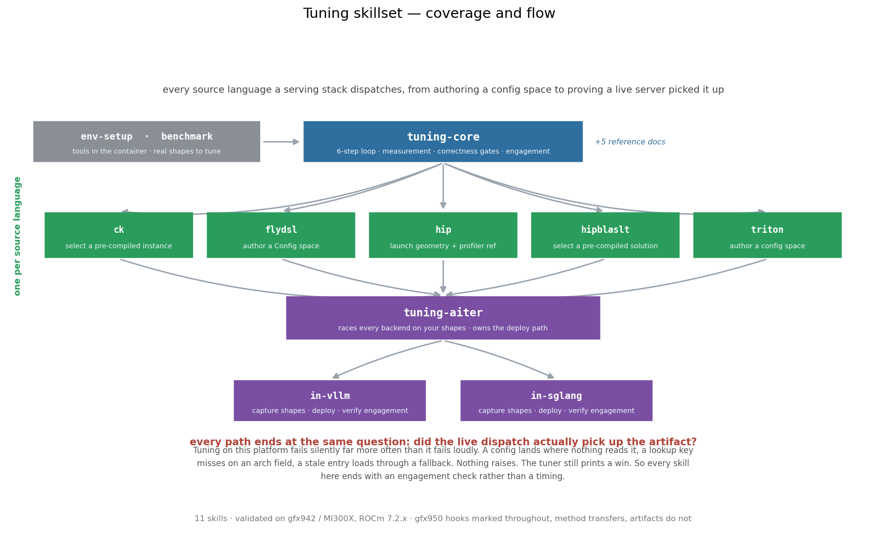
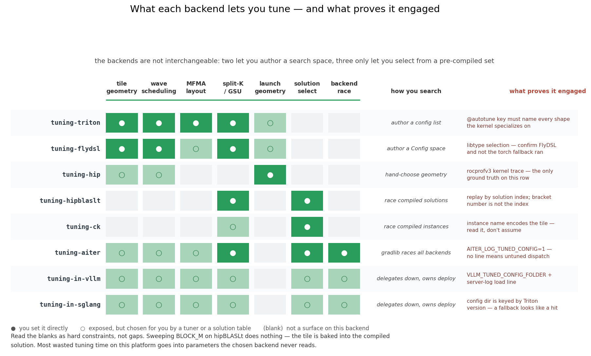

# GPU op tuning skillset — AMD Instinct

Skills for tuning GEMM and other GPU ops on AMD Instinct hardware, across every source
language a serving stack touches, inside the vLLM and SGLang runtime images.

Everything here is method. Where a number appears it is a worked example measured on-box —
gfx942 / MI300X and gfx950 / MI355 under ROCm 7.2.x — included because it demonstrates *how to
tell a real result from a fake one*, not because it is a value to reuse. Tuned parameters do
not transfer across shapes, architectures, or library versions; the procedure does.

Most claims now carry both parts side by side. Where a claim has been checked on only one,
it says so. [`docs/coverage_gfx950.md`](docs/coverage_gfx950.md) is the ledger: what was
re-measured on MI355, what changed, and what is still quoted from gfx942.

## The thesis

> A tuning run that reports a speedup has proven nothing until you have shown that the
> artifact it produced is the code the machine actually runs.

Almost every way tuning fails on this platform fails *silently*: the artifact lands where
nothing reads it, the lookup misses on an architecture key, a stale config loads via a
fallback, the benchmark measures cache instead of compute. No exceptions are raised and the
numbers look plausible. So every skill here ends with an engagement check, not a timing.

## Start here

| you want to… | read |
| --- | --- |
| **check whether this model + stack is already tuned** | **`tuning-kb/README.md`** |
| understand the loop everything else specializes | `tuning-core/SKILL.md` |
| get a container ready to tune | `env-setup/SKILL.md` |
| find shapes to tune against | `benchmark/README.md` |
| tune a serving decode path (graph-captured) | `tuning-core/graph_captured_benchmarking.md` |

**Check `tuning-kb/` first.** It records wins that were already found and reproduced on specific
model + hardware + library combinations, with the deployable artifact and the numbers to expect. If
your environment matches an entry, deploy the known answer in an hour and spend the rest of your
time somewhere new. If it partially matches, the entry's shape list and its record of what turned
out *not* to work are still worth more than starting cold.

## By source language

| language | skill | tuning is… | on MI355 |
| --- | --- | --- | --- |
| Triton / Gluon | `tuning-triton/` | authoring a config space; the autotuner only races what you supply | all 3 tables re-measured |
| FlyDSL | `tuning-flydsl/` | same model as Triton, different `Config` semantics | re-swept; 880 TFLOPS |
| aiter | `tuning-aiter/` | racing *across* backends, then deploying a CSV row | tuner run; 2 CLI bugs found; MX ops covered (§7) |
| hipBLASLt | `tuning-hipblaslt/` | selecting among pre-compiled solutions | bench rebuilt; 1241 TFLOPS; MX unraceable (§6b) |
| Composable Kernel | `tuning-ck/` | selecting among pre-compiled instances | all 7 aiter tuners run; `gemm_mx` raced (§2c) |
| raw HIP | `tuning-hip/` | choosing launch geometry; profiler is the only feedback | rebuilt; async trap re-shown |

The right-hand column is the answer to "is this verified on MI355": every backend was
re-exercised on the part rather than carried over, and where a number moved it is in both
the skill and [`docs/coverage_gfx950.md`](docs/coverage_gfx950.md). The largest single
correction is measurement itself — on gfx950 a back-to-back A/B drifts 20-67% and has to be
interleaved (`tuning-core/measurement.md` Rule 6b).

The microscaled formats (MXFP4 / MXFP8) are the part of MI355 with no gfx942 counterpart, and
they are covered in [`docs/coverage_gfx950.md`](docs/coverage_gfx950.md) §12. The short version:
**MXFP8 has no aiter operator in either shipped image** — it is reachable only through CK's
`gemm_mx` — while MXFP4 has six, four of which now have corpus cases finding up to 72.8%.

Two tuning surfaces in `rocm-libraries` have **no skill here**, and are listed rather than
quietly omitted: CK's `tile_engine` (declare a config space, *generate* new CK instances) and
hipBLASLt's `tensilelite` (generate new solutions). Both skills cover selecting among what
ships; neither covers producing something that does not.
[`docs/coverage_gfx950.md`](docs/coverage_gfx950.md) §11 has the full scan.

`tuning-hip/` §4 is also the **profiler reference** the other skills point at: `rocprofv3`
sees the kernel that ran regardless of which language produced it.

## By serving framework

| framework | skill |
| --- | --- |
| vLLM | `tuning-in-vllm/` |
| SGLang | `tuning-in-sglang/` |

## How the pieces fit

```
                       tuning-core           ← the 6-step loop, measurement,
                            │                  correctness gates, engagement
        ┌───────────────────┼───────────────────┐
        │                   │                   │
    env-setup           benchmark          per-language skills
    (get tools)      (what to tune on)   triton · flydsl · ck ·
                                         hipblaslt · hip
                                                │
                                          tuning-aiter
                                     (races them all, owns the
                                      deploy path into serving)
                                                │
                                    ┌───────────┴───────────┐
                              tuning-in-vllm         tuning-in-sglang
```



`tuning-kb/` sits alongside this tree rather than inside it: it is the memory, not the method —
per-model records of results already verified on a specific stack, so a matching environment can
skip to deployment.

aiter is the integration point. Its gradlib tuner races hipBLASLt, Triton, FlyDSL, CK, asm,
skinny and torch against each other on your shapes and records the winner in a `libtype`
column — so the per-language skills cover *authoring-time* tuning, and `tuning-aiter/` owns
the path that changes what a live server dispatches. (There is no `--libtype` flag on gradlib to
select among them; earlier versions of this file said there was. See `tuning-aiter/` §4.)

**gradlib serves dense bf16 only.** Every quantized GEMM — fp8, int8, fp4, batched, MoE — goes
through a separate per-op tuner under `csrc/ck_gemm_*/`, with different flags, a different result
schema, no torch candidate to serve as a floor, and split-K off by default. Confirm which tuner
owns your op before running one: `tuning-aiter/` §4 has the comparison table, `tuning-ck/` §3 has
the tuners.

## What each backend actually lets you tune

The backends do not offer the same surface. Two let you **author** a search space, three only
let you **select** from a pre-compiled set, and one gives you nothing but launch geometry and
a profiler. Sweeping `BLOCK_M` against hipBLASLt does nothing — the tile is baked into the
compiled solution. Read the blanks below as hard constraints, not as gaps in the skillset:



The right-hand column is the one to read first. Each backend has its own way of appearing to
succeed while nothing changed, and its own string that settles it.

Both figures are generated — `python3 tools/skill_map.py` reads the `SKILL.md` frontmatter of
every skill directory, so adding a skill updates the map rather than dating it.

## Validation

Every load-bearing claim in these skills is an executable check in
[`validate/claims.py`](validate/README.md). Run it in the container you intend to tune in:

```bash
python3 validate/claims.py                  # all applicable claims
python3 validate/claims.py --skill triton   # one skill
```

37 claims, re-checked in **both** shipped images on **both** parts (the counts below predate the
three most recent, which came out of the Qwen3-8B run — see the note after the table):

| | vllm on gfx942 | sglang on gfx942 | vllm on gfx950 | sglang on gfx950 |
| --- | --- | --- | --- | --- |
| PASS | 15 | 14 | 28 | 28 |
| FAIL | **0** | **0** | **0** | **0** |
| N/A (precondition absent) | 3 | 4 | 6 | 6 |

(The gfx942 columns are the original 18-claim run; the sixteen claims added since are gfx950
findings and are marked with what they observed on each part. Three cover the
microscaled formats: that MXFP8 has no aiter operator on either image, that the batched MXFP4
`_get_config` takes packed K, and that hipBLASLt refuses to race MX types.)

The three newest claims exist because the corresponding documentation had **drifted from the code
and was actively misleading**, which is the failure mode this harness is for. They assert that
aiter's tuned-config *hit* log line is gated behind `AITER_LOG_TUNED_CONFIG` while the *miss* line
is not (so the usual engagement grep returns zero against a working deploy), that the lookup is
`lru_cache`d on raw M (so log-line counts measure shape diversity rather than call frequency), and
that the per-op quantized tuner takes `-i/-o` with split-K **off** by default and a different result
schema than gradlib. Each was a wrong instruction in this skillset before it was a claim here.

Two of them read a `rocm-libraries` source checkout rather than probing a device, because what
they assert is a property of the shipped source: CK's runtime `get_device_name()` instance
gates, and the Origami-dominated gfx950 Tensile logic tree. Point them at a checkout with
`ROCM_LIBRARIES=<path>`; without one they correctly report N/A rather than passing.

`N/A` is not a pass — it means that image cannot answer (no `hipblaslt-bench` built, no
`vllm` in the sglang image, no aiter source checkout in the vllm wheel). Every
framework-independent claim passes everywhere, which is the property that matters: the method
does not depend on which serving stack is on top, or which part is underneath.

Running it across all four found things no single combination would have:

- torch exposes the LDS limit on the vllm image and **not** on sglang's older torch, where a
  naive read returns a silent `0`;
- the aiter tuned tables are reachable for only 83 of 9964 rows at `cu_num=304`, against
  21 133 of 23 729 at `cu_num=256` in the vllm image — the CK tables favour MI355, and by a
  lot;
- eleven of the thirteen rows in aiter's shipped fused-MoE shape list are FNUZ, so the MoE
  tuner aborts on gfx950 with its own default input;
- vLLM and SGLang report **different device names for the same GPU**, so tuned MoE configs do
  not transfer between the two frameworks on one machine;
- CK adds and removes GEMM instances at runtime behind `get_device_name() != "gfx950"` — 166
  such gates, 87 of them exclusions — so a candidate count is not comparable across parts.

Details and the full N/A breakdown in [`validate/README.md`](validate/README.md);
[`docs/coverage_gfx950.md`](docs/coverage_gfx950.md) has the measurements behind each.

The live-server leg — stand up a model, drive traffic, A/B serving metrics — is still
described from code paths rather than measured. What *is* now measured on gfx950 is the config
load path itself: both frameworks' hit and miss log lines were reproduced by planting files and
reading what the lookup emitted.

## Architecture

Measured on **gfx942 (MI300X, 304 CU)** and **gfx950 (MI355X, 256 CU)**. Constants for both
parts are measured, not inferred; `tuning-core/arch_migration.md` carries the full table with
the tool that produced each row.

Method transfers between them completely. Artifacts do not — lookup keys include `gfx` and
`cu_num`, so a config tuned on one is invisible or rejected on the other. Three divergences
need explicit care:

- **FP8 dialect** — gfx942 computes FNUZ and refuses OCP; gfx950 does exactly the opposite.
  Identical 8-bit layout, different exponent bias, so a mismatch corrupts numerics silently
  instead of failing. The two parts do not word the refusal the same way, which matters more
  than the symmetry: gfx950's text is the same one hipBLASLt uses for an unsupported shape.
- **gfx950-only features** — microscaled dtypes (mxfp4/mxfp8), scaled MFMA, the Gluon `cdna4`
  dialect. Shapes using these have no gfx942 configuration to carry over at all, and FP4 is
  where the bulk of aiter's gfx950-only surface lives.
- **Constants that shifted without the formulas shifting** — LDS per block (65 536 →
  163 840 B) and the dispatch floor (0.042 → 0.017 ms). The prune formula and the
  classification logic both ported unchanged, so there is nothing to notice when the numbers
  behind them are stale.

For shared dtypes and ops, the same skills apply unchanged — re-run the tuning, do not copy
the results.

## Using these as Claude Code skills

Each directory holds a `SKILL.md` with frontmatter and is independently invocable. Supporting
files sit alongside and are referenced by relative path. `tuning-core/` is the shared
foundation every other skill assumes.

`tuning-kb/` is the exception: it has no `SKILL.md` because it is data, not method — a set of
per-model records to be looked up. **If you are using a task bundle as a blind evaluation, remove
`tuning-kb/` from the copy you hand the agent**, or it may find the answer instead of deriving it.
See the note at the end of `tuning-kb/README.md`.
